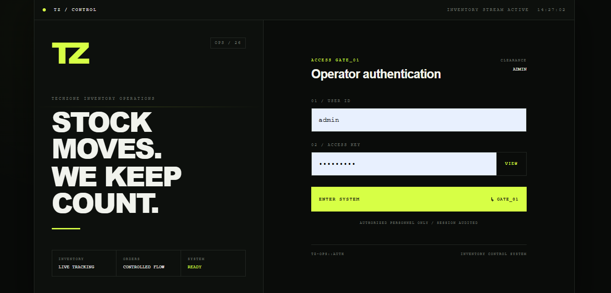
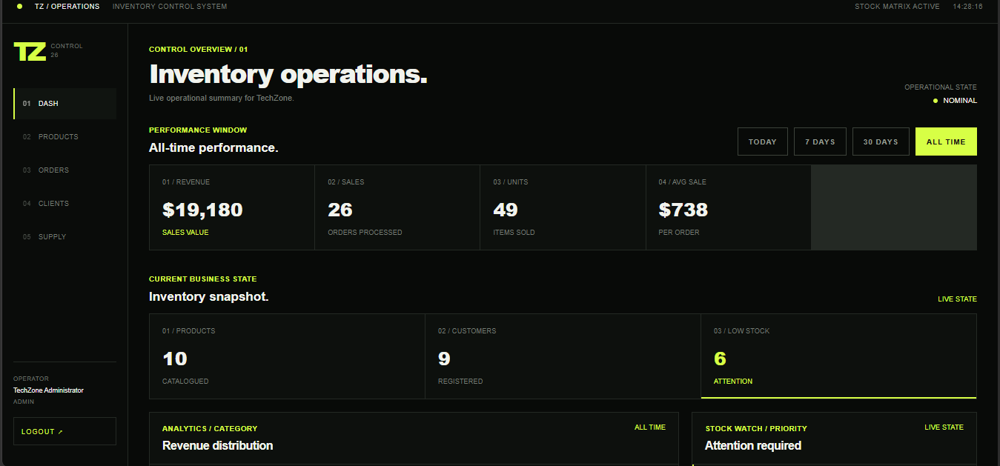
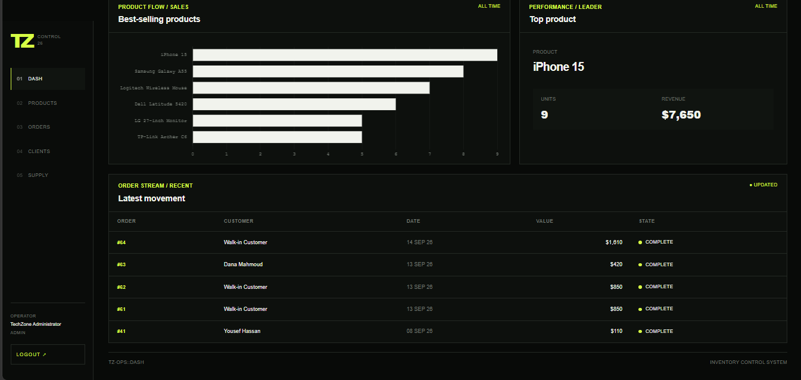
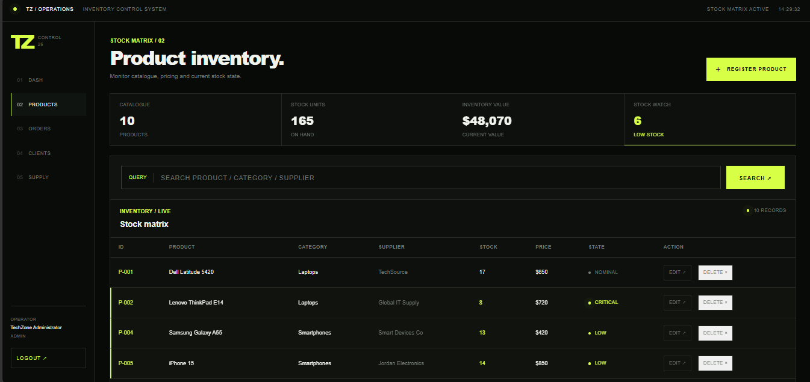
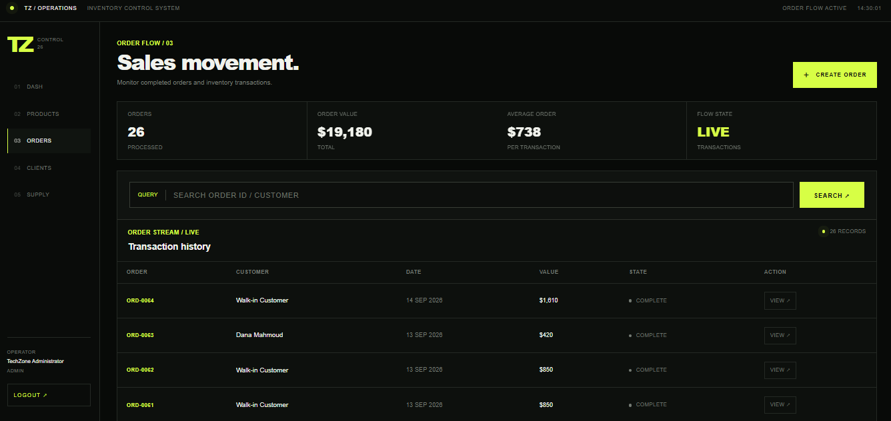
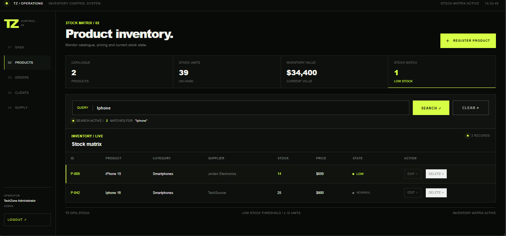
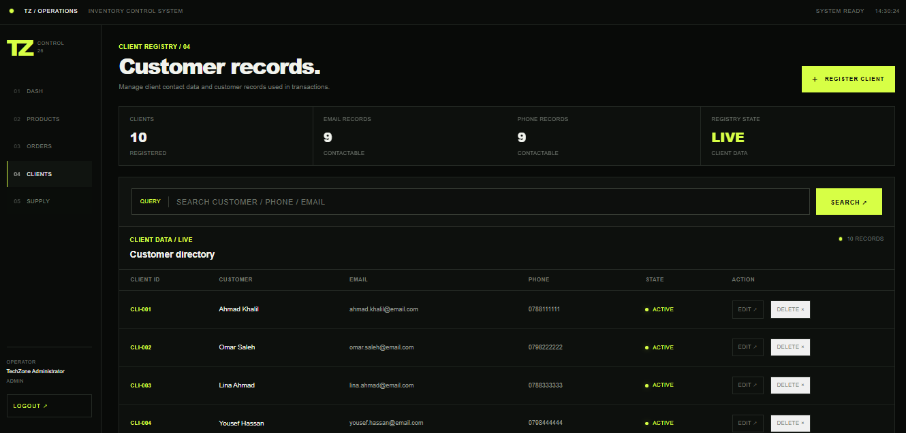

# TechZone

### Inventory Operations & Sales Management System

TechZone is a full-stack inventory and sales management system built for small and medium-sized businesses that need a centralized way to control stock, process sales, manage customers and suppliers, and monitor business performance.

The system was designed and developed using **PHP, Oracle Database, OCI8, HTML, CSS, and JavaScript**, with an emphasis on transactional integrity, application security, and practical business workflows.

> **Version:** TechZone v1.0  
> **Status:** Stable Release  
> **Source:** Private / Commercial Project

---

## Overview

Many small businesses still manage inventory and sales using spreadsheets, disconnected records, or manual processes.

TechZone provides one operational system for inventory tracking, sales processing, customer records, supplier management, stock validation, sales analytics, operational search, access control, and audit logging.

The interface was designed around an industrial inventory-control concept rather than a generic administration dashboard.

---

## Interface

### Operator Authentication



TechZone uses authenticated operator sessions with role-based access control and login protection.

### Inventory Operations Dashboard



The dashboard provides a live overview of revenue, sales processed, units sold, average sale, product count, registered customers, and low-stock alerts.

Performance can be analyzed across **Today · 7 Days · 30 Days · All Time**.

### Sales Analytics



TechZone provides operational analytics including best-selling products, revenue distribution, top-product performance, and recent transaction movement. Sales analytics are calculated from Oracle data rather than static dashboard values.

### Product Inventory



The inventory module provides centralized control over products, categories, suppliers, pricing, stock quantities, inventory value, and low-stock states. Products can be searched by product name, category, or supplier.

### Sales Movement



Completed transactions are maintained as an order history containing the order identifier, customer, transaction date, order value, transaction state, and detailed order information.

### Transaction Processing



TechZone supports **Walk-in Sale** and **Registered Customer Sale** workflows. During order execution, TechZone validates inventory, creates the order and its items, updates stock, calculates totals, and commits the operation as a database transaction. If processing fails, the operation is rolled back to preserve inventory consistency.

### Customer Registry



Customer records can be maintained and associated with sales transactions. TechZone also maintains a protected **Walk-in Customer** system record for counter sales where personal customer information is not required.

---

## Core Features

### Inventory

- Product management
- Category organization
- Supplier relationships
- Stock tracking and valuation
- Low-stock detection
- Product search

### Sales

- Transaction-safe order creation
- Walk-in and registered-customer sales
- Automatic stock deduction
- Order history and details
- Sales performance analytics

### Business Records

- Customer and supplier management
- Customer and supplier search
- Historical-record protection
- Safe deletion rules

### Dashboard

- Revenue and sales volume
- Units sold and average transaction value
- Inventory status and low-stock monitoring
- Revenue distribution
- Best-selling products
- Recent transactions
- Time-based performance filtering

---

## Security Engineering

TechZone was built with security controls beyond basic CRUD functionality:

- Secure PHP password hashing and verification
- Session ID regeneration after authentication
- Session inactivity timeout
- HTTP-only and SameSite session cookies
- HTTPS-aware secure cookies
- CSRF protection
- Database-backed login rate limiting
- Role-based authorization
- Server-side validation
- Oracle bind variables
- Database CHECK constraints
- Transaction-safe order processing
- Stock-sensitive row locking
- Audit logging
- Application/security/database logging
- Protected error handling
- Historical-record deletion protection

Authorization is enforced on the server side rather than relying only on hidden interface controls.

---

## Role-Based Access Control

| Role | Access |
| --- | --- |
| `ADMIN` | Full operational access |
| `STAFF` | Operational create/edit and permitted management actions |
| `VIEWER` | Read-only access |

---

## Database Design

TechZone uses Oracle Database as its persistence layer.

```text
CATEGORIES
     │
     └──── PRODUCTS ──── SUPPLIERS
               │
          ORDER_ITEMS
               │
             ORDERS
               │
           CUSTOMERS

USERS
AUDIT_LOGS
LOGIN_ATTEMPTS
```

The database also uses primary keys, foreign keys, sequences, CHECK constraints, views, and transaction control. Relationships between orders and inventory records are preserved to maintain historical business integrity.

---

## Architecture

```text
┌──────────────────────────────┐
│          Web Browser         │
│     HTML / CSS / JavaScript  │
└──────────────┬───────────────┘
               │ HTTP/HTTPS
               ▼
┌──────────────────────────────┐
│        Apache / PHP 8        │
│ Authentication               │
│ Authorization                │
│ Validation                   │
│ Business Logic               │
│ Transaction Processing       │
│ Audit / Logging              │
└──────────────┬───────────────┘
               │ OCI8
               ▼
┌──────────────────────────────┐
│        Oracle Database       │
│ Products / Inventory         │
│ Orders / Order Items         │
│ Customers / Suppliers       │
│ Users / Audit Trail          │
│ Login Protection            │
└──────────────────────────────┘
```

See [docs/architecture.md](docs/architecture.md) for the technical architecture overview.

---

## Technology Stack

| Layer | Technology |
| --- | --- |
| Backend | PHP 8.2 |
| Database | Oracle Database |
| Database Driver | OCI8 |
| Web Server | Apache / XAMPP |
| Frontend | HTML5, CSS3, JavaScript |
| Development Environment | Windows |

TechZone v1.0 has been tested with Oracle Database 10g XE. Compatibility with newer Oracle Database releases is planned for validation in an appropriate target environment.

---

## Engineering Highlights

**Transactional inventory processing** — orders and stock updates are handled together so partial transactions do not leave inventory in an inconsistent state.

**Concurrent stock protection** — stock-sensitive order operations use database locking where appropriate.

**Historical integrity** — products, customers, and suppliers referenced by operational history cannot simply be deleted.

**Walk-in transaction model** — counter sales can be processed without collecting unnecessary customer information while maintaining database relationships.

**Layered application security** — authentication, authorization, CSRF protection, rate limiting, validation, database constraints, auditing, and protected logging work together rather than relying on a single control.

---

## Project Status

### TechZone v1.0 — Stable

The v1.0 release has completed functional and security regression testing for its current supported environment. Future development can continue independently while v1.0 remains preserved as the stable release.

Potential future areas include extended reporting, invoice/export functionality, additional inventory operations, administrative user management, deployment improvements, and modern Oracle Database certification.

---

## Source Code

TechZone is being developed as a **commercial/freelance software project**.

The complete production source code and deployment configuration are maintained privately. This repository serves as a technical portfolio and project showcase containing documentation, architecture information, feature descriptions, and interface demonstrations.

No production credentials or private customer data are included.

---

## Developer

**Basel**

Cybersecurity student.

`PHP` · `Oracle SQL` · `Database Design` · `OCI8` · `Web Security` · `Authentication` · `RBAC` · `Transaction Processing` · `Inventory Systems`

---

**TechZone v1.0**  
*Inventory Operations & Sales Management System*
